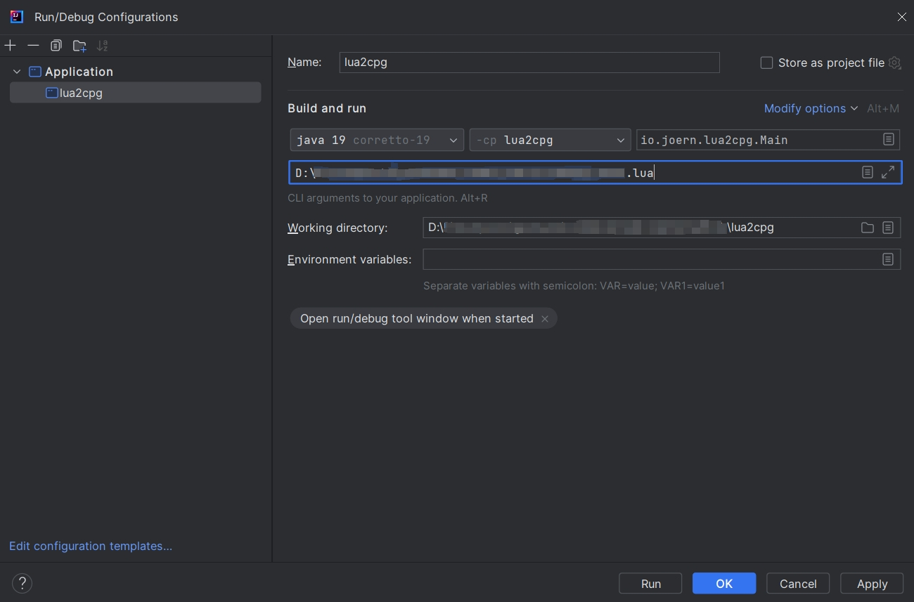

# lua2cpg

lua2cpg是扩展Joern对Lua语言支持的一个CPG前端。本版本基于**Joern Version: 2.0.166**编写，需要接入joern使用可能会有版本不匹配情况。

## 安装

可以使用IntelliJ IDEA 进行安装使用。

+ 将项目导入idea，选择sbt项目
+ 等待从sbt中拉取项目结构
+ 编辑 idea 的配置

## 接入Joern

由于Joern版本一直在更新，该前端基于**Joern Version: 2.0.166**编写，可以独立运行生成前端的cpg.bin。

如果需要接入对应joern的`joern/joern-cli/frontends/`目录下，过早版本或者未来joern继续更新可能造成版本不匹配，这里给出两个版本Joern的前端接入方法：

[**lua2cpg-joernV2.0.166**](https://github.com/Marsxu626/lua2cpg-joernV2.0.166)

[**lua2cpg-joernV2.0.225**](https://github.com/Marsxu626/lua2cpg-joernV2.0.225)