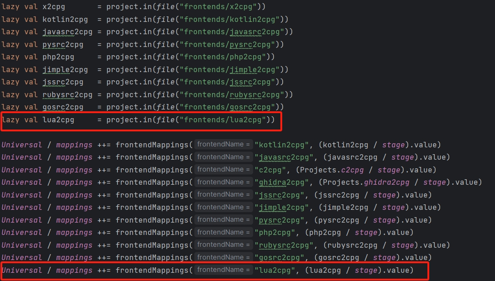
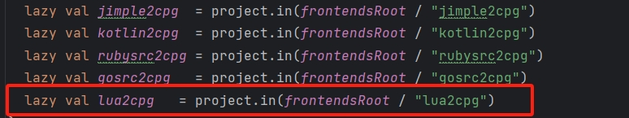
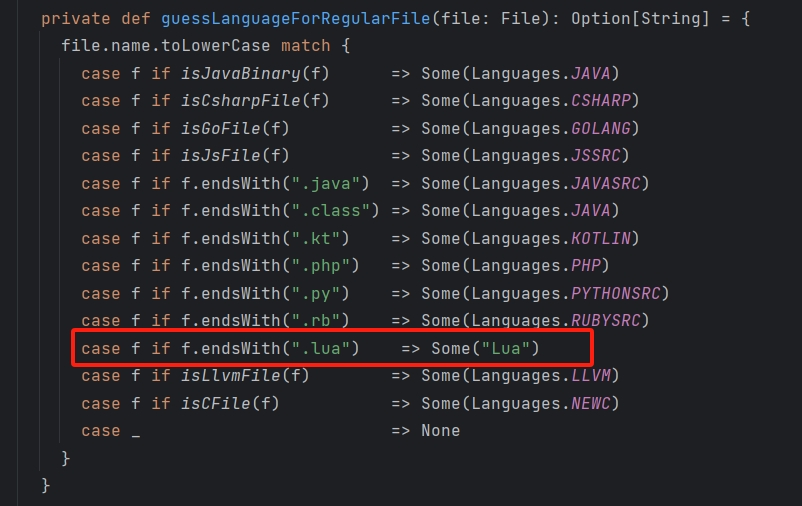
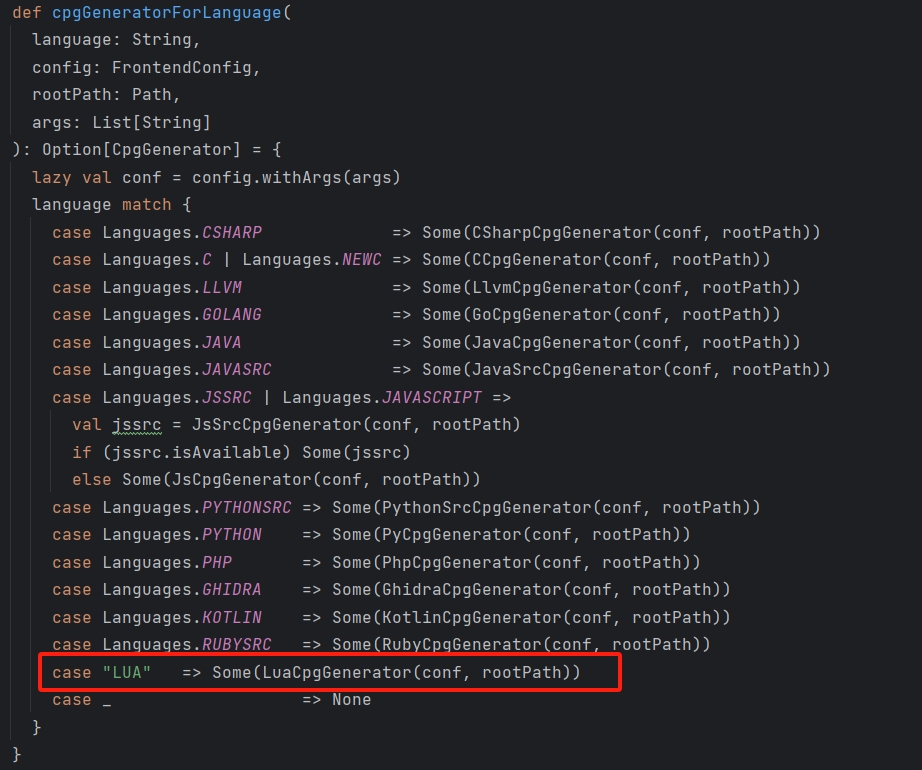
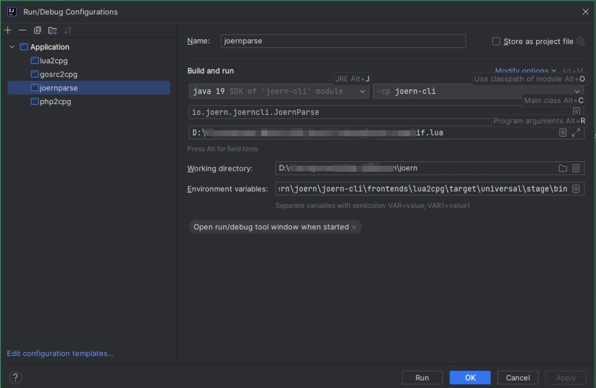

# lua2cpg

lua2cpg是扩展Joern对Lua语言支持的一个CPG前端。

## 安装环境

本地安装Joern的环境

## 接入Joern

### 第一步：配置sbt文件

1. 将lua2cpg项目复制到本地Joern环境的`joern/joern-cli/frontends/`目录下

2. 配置`joern/joern-cli/`下的`build.sbt`文件

   + 在相应位置添加以下两行配置内容：

   ```scala
   lazy val lua2cpg     = project.in(file("frontends/lua2cpg"))
   
   Universal / mappings ++= frontendMappings("lua2cpg", (lua2cpg / stage).value)
   ```

   

3. 配置`joern/`目录下的`build.sbt`文件

   + 相关位置添加以下两个内容

   ```scala
   lazy val lua2cpg           = Projects.lua2cpg
   
   lazy val aggregatedProjects: Seq[ProjectReference] = Seq(
     ……//省略
     lua2cpg
   )
   ```

4. 配置`joern/project/`目录下的`Projects`文件

   + 相关位置添加以下内容

   ```scala
   lazy val lua2cpg   = project.in(frontendsRoot / "lua2cpg")
   ```

   

### 第二步：重新编译

1. 完成上面步骤之后可以命令行进入joern的根目录，然后执行以下指令检测整个项目是否有错误

   ```
   sbt
   ```

2. 成功之后，重新在命令行中执行以下指令进行编译

   ```
   sbt stage
   ```

3. 编译完成后，可以看到`lua2cpg`目录下出现target目录，而且存在`lua2cpg\target\universal\stage\bin`目录下的`lua2cpg.bat`和`lua2cpg`文件，即说明编译成功

### 第三步：joernParse相关配置

位于`joern\joern-cli\src\main\scala\io\joern\joerncli\console`下的`JoernParse`是负责源码生成Cpg的相关控制程序。其会根据输入的文件名判断使用何种前端进行转换。以下对Lua语言接入进行配置。

1. 在`joern\console\src\main\scala\io\joern\console\cpgcreation`目录下，添加一个名为`LuaCpgGenerator.scala`文件，内容为：

   ```scala
   package io.joern.console.cpgcreation
   
   import io.joern.console.FrontendConfig
   
   case class LuaCpgGenerator(config: FrontendConfig, rootPath: Path) extends CpgGenerator {
     private lazy val command: Path        = if (isWin) rootPath.resolve("lua2cpg.bat") else rootPath.resolve("lua2cpg")
   
     override def generate(inputPath: String, outputPath: String): Try[String] = {
       val arguments = List(inputPath) ++ Seq("-o", outputPath) ++ config.cmdLineParams
       runShellCommand(command.toString, arguments).map(_ => outputPath)
     }
   
     override def isAvailable: Boolean =
       command.toFile.exists
   
     override def isJvmBased = true
   }
   ```

2. 在同样目录下的`package.scala`文件中，对应地方添加以下两行内容

   ```scala
   case f if f.endsWith(".lua")    => Some("LUA")
   ```

   

   ```scala
   case "LUA"   => Some(LuaCpgGenerator(conf, rootPath))
   ```

   

   完成上述配置，即可通过配置joernparse来生成lua语言的cpg.bin文件

   

   值得注意环境变量`SHIFTLEFT_OCULAR_INSTALL_DIR=joern所在目录\joern\joern-cli\frontends\lua2cpg\target\universal\stage\bin`